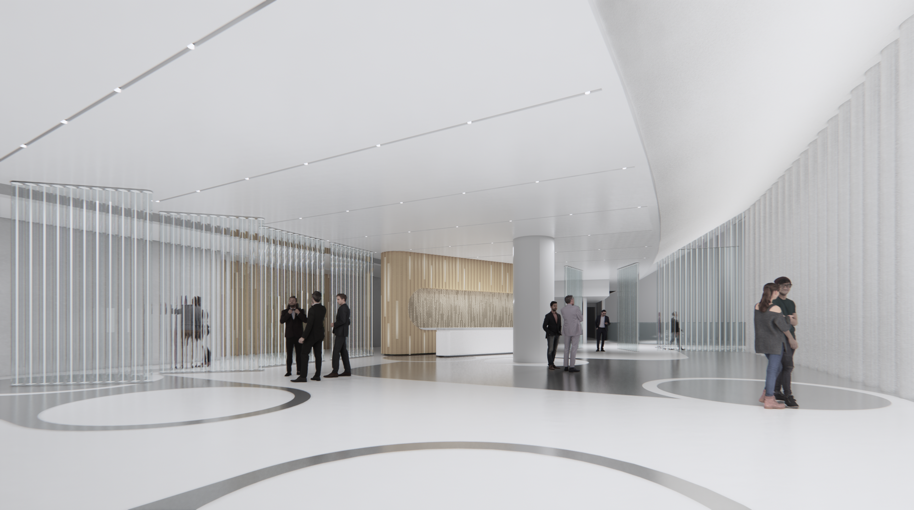

# Circle Packing

A Grasshopper study that generates a dense packing of non-overlapping circles
inside a boundary region, with circle sizes adapting to fill the available
space. Used to generate a floor pattern.

## Files

| File | What it is |
|------|------------|
| [`circle_packing.gh`](circle_packing.gh) | The Grasshopper definition. Open in Rhino/Grasshopper. |

The packing routine and its parameters live inside the definition — open the
`.gh` in Grasshopper to inspect and adjust them.

## Usage

1. Open `circle_packing.gh` in Grasshopper (Rhino 7+).
2. Reference the boundary geometry into the definition.
3. Adjust the packing parameters (count, radius range, iterations) and let the
   solver relax the circles into place.

## Renders

Enscape renders from April 2020 using the packed output as a floor pattern.

## Software

- Rhino + Grasshopper (Rhino 7 or later)
- Enscape (rendering)
