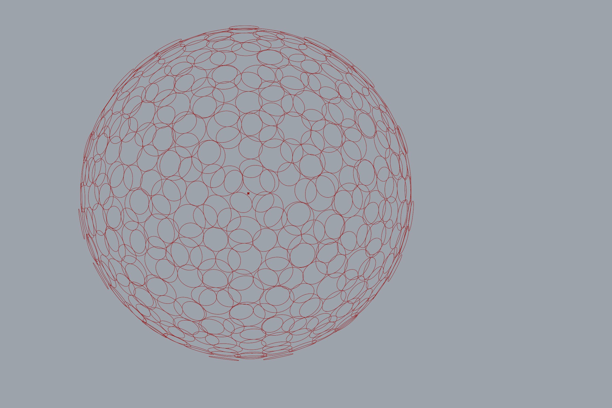

# Dome Panelization

A Grasshopper definition that panelizes a dome / spherical surface: points are
distributed across the surface (geodesic-style even spacing), a plane is aligned
to the surface at each point, and a circular panel is placed on each plane. The
result is an overlapping circular-panel skin over the dome.

## Files

| File | What it is |
|------|------------|
| [`dome_panelization.ghx`](dome_panelization.ghx) | The Grasshopper definition (XML format). Built entirely from native components and clusters — no plugins or Python required. |

## Usage

1. Open `dome_panelization.ghx` in Grasshopper (Rhino 7+).
2. Reference the dome / sphere surface into the definition.
3. Adjust the point-distribution count and the panel radius to control panel
   size and overlap.

## Software

- Rhino + Grasshopper (Rhino 7 or later)
