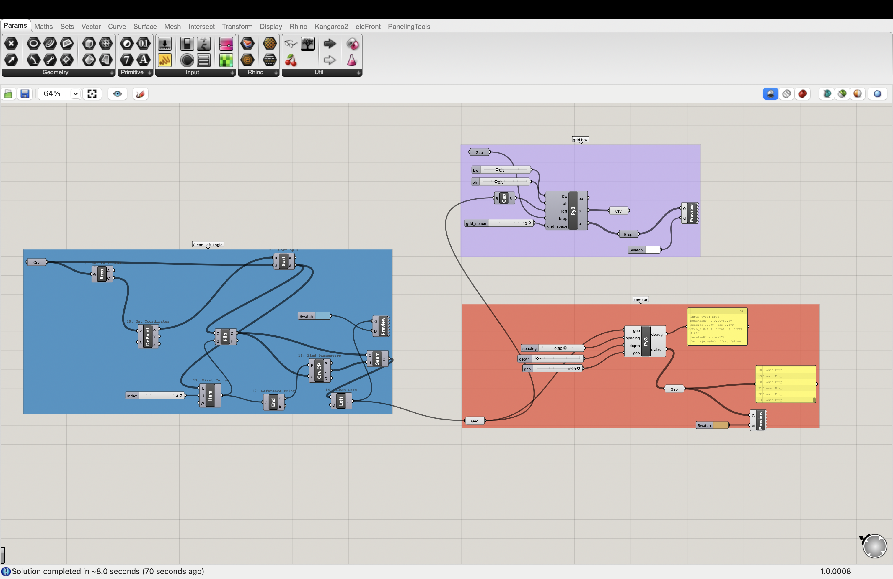
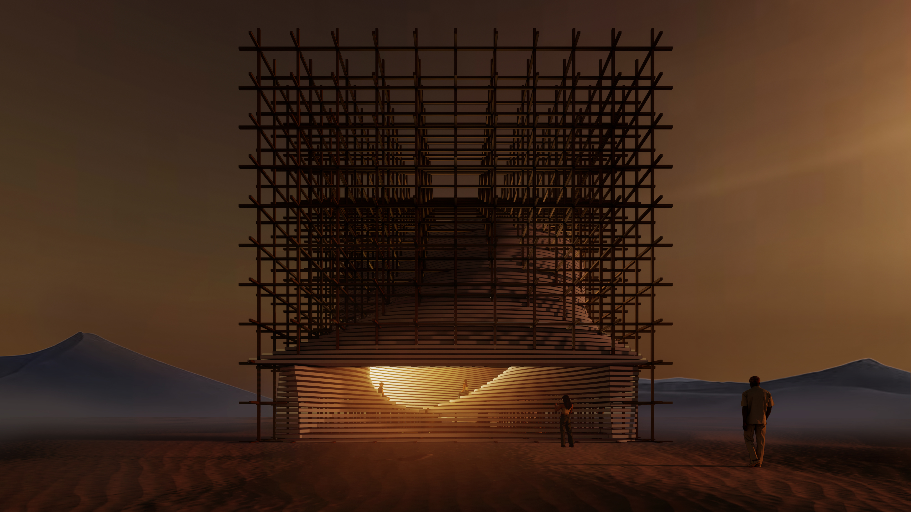
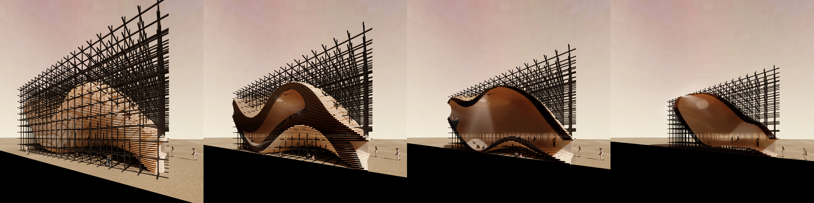
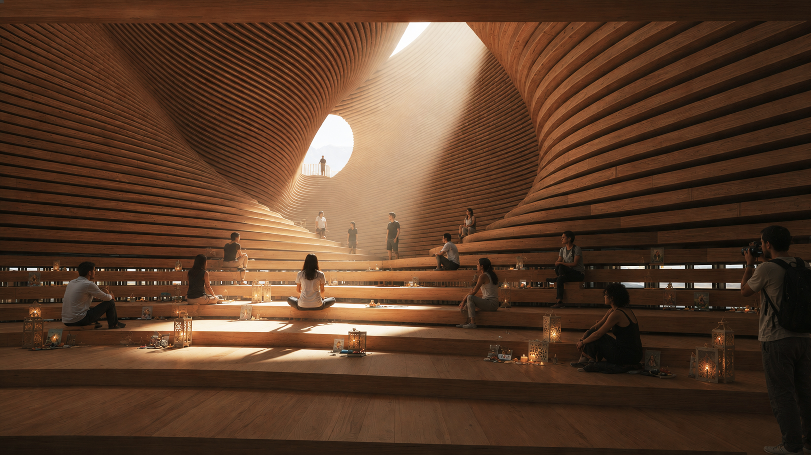

# Lofting Lattice With Grid

A Grasshopper definition that turns a single input surface into two layered
systems: a stack of horizontal lofted slabs (treads) cut from the surface, and
a three-dimensional grid of rectangular beams trimmed to a lofted solid.

## Files

| File | What it is |
|------|------------|
| [`lofting_lattice_with_grid.gh`](lofting_lattice_with_grid.gh) | The master Grasshopper definition. Open this in Rhino/Grasshopper. |
| [`lofting_lattice_with_grid_slabs.py`](lofting_lattice_with_grid_slabs.py) | Extracted copy of the GhPython component that builds the stacked slabs. |
| [`lofting_lattice_with_grid_beams.py`](lofting_lattice_with_grid_beams.py) | Extracted copy of the GhPython component that builds the trimmed beam grid. |

The `.py` files are already embedded inside the `.gh` component. They are pulled
out here so the logic is readable on GitHub and reusable in other definitions.

## Components

### `lofting_lattice_with_grid_slabs.py` — stacked lofted slabs

Slices the input geometry with evenly spaced horizontal planes, offsets each
section curve to a tread depth, and lofts/extrudes it into a solid slab.

**Inputs**

| Name | Type | Description |
|------|------|-------------|
| `geo` | Surface / Brep / Mesh | Feed a Surface or Brep for smooth NURBS cuts; a Mesh falls back to a re-meshed intersection. |
| `spacing` | float | Vertical pitch: top-to-top distance between steps. |
| `gap` | float | Empty vertical space between steps (step height = `spacing - gap`). |
| `depth` | float | Horizontal tread depth. Leave at `0` to auto-default to `spacing * 2`. |

**Outputs**

| Name | Description |
|------|-------------|
| `slabs` | The generated slab solids (Breps). |
| `debug` | A text log: intersection mode, Z range, slab count, rejected sections. |

### `lofting_lattice_with_grid_beams.py` — parametric box with grid beams

Derives a bounding box from a boundary Brep, builds a full X/Y/Z line grid at a
fixed spacing, trims every line to the part that lies outside a closed lofted
solid, and extrudes each surviving segment into a rectangular beam.

**Inputs**

| Name | Type | Description |
|------|------|-------------|
| `brep` | Brep | Outer boundary; its bounding box sets the grid extents. |
| `loft` | Brep | Closed lofted solid; grid lines are trimmed at its surface. |
| `grid_space` | float | Grid spacing (ft). |
| `bw` | float | Beam cross-section width (ft). |
| `bh` | float | Beam cross-section height (ft). |

**Outputs**

| Name | Description |
|------|-------------|
| `grid_lines` | Trimmed grid lines (curves). |
| `beams` | Rectangular beam extrusions (Breps). |

## Usage

1. Open `lofting_lattice_with_grid.gh` in Grasshopper (Rhino 7+).
2. Reference the driving surface / boundary geometry from Rhino into the
   definition's inputs.
3. Adjust `spacing`, `gap`, `depth`, `grid_space`, `bw`, and `bh` sliders to
   taste.

## Renders

Project renders using output from this definition:

| | |
|---|---|
|  |  |
|  | |

## Software

- Rhino + Grasshopper (Rhino 7 or later)
- RhinoCommon / `Rhino.Geometry` (via GhPython)
